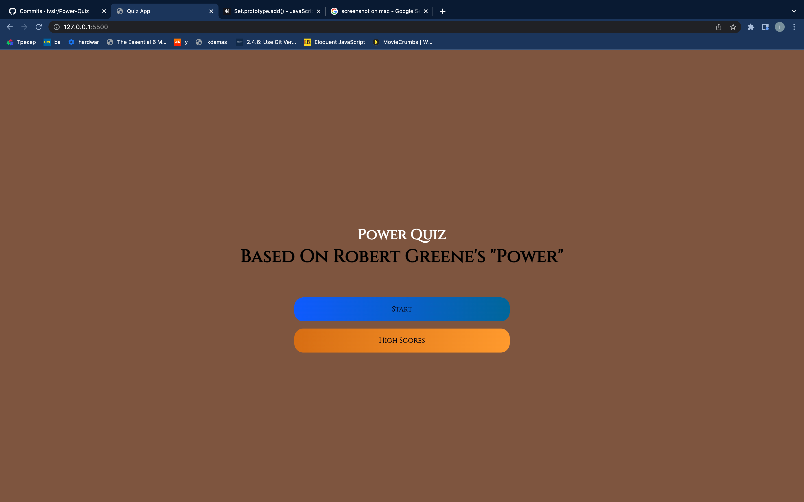
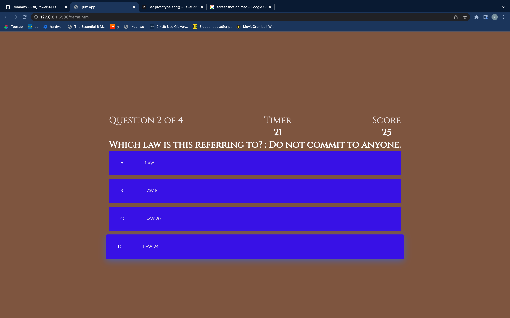
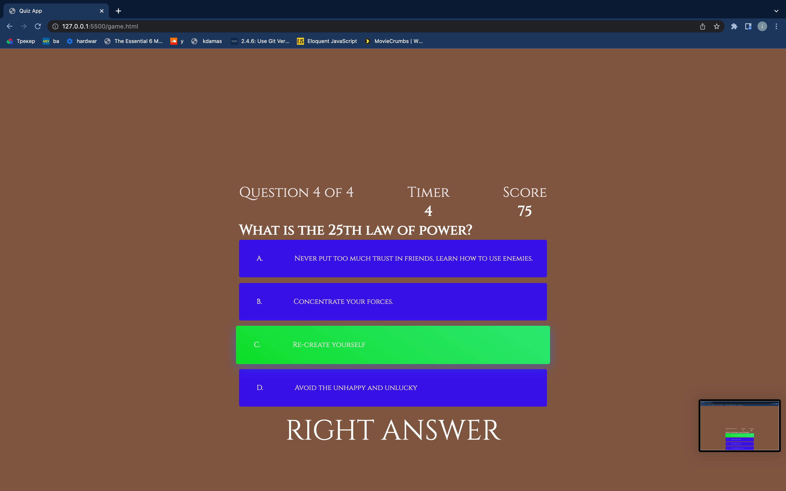
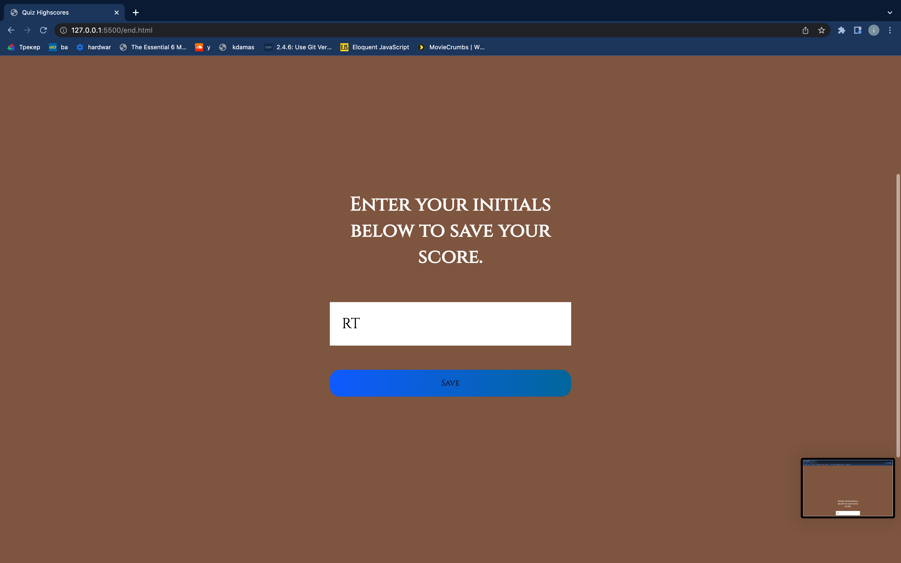
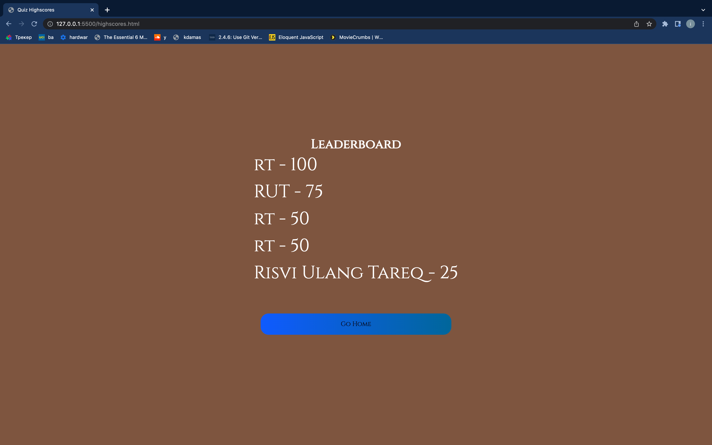

# 04 Web APIs: Robert Greene's "POWER" Quiz
Module 4 Challenge

## Description
I was assigned a project in which I had to create a quiz using javascript, Web APIs, HTML and CSS. The first page include a start button and a high score button in which users can view the highest five scores from recent quiz takers. When users click the start button, they are taken to the questions pages and given thirty seconds to answer four quiz questions. If they get a question wrong, then 5 seconds is taken off the timer. If the user completes the quiz or the time runs out, then the user is prompted to enter his/her initials. If the score is higher than the previous scores, then it will be saved.

## Table of Contents
<nav>
    <ol>
        <li><a href="#How to Use this Project">How to Use this Project</a></li>
        <li><a href="#Contributors">Contributors</a></li>
    </ol>
</nav>

## How to Use this Project
<a href="https://ivsir.github.io/Power-Quiz/">This is the link to my WebPage</a>

## Contributors
Risvi Tareqs